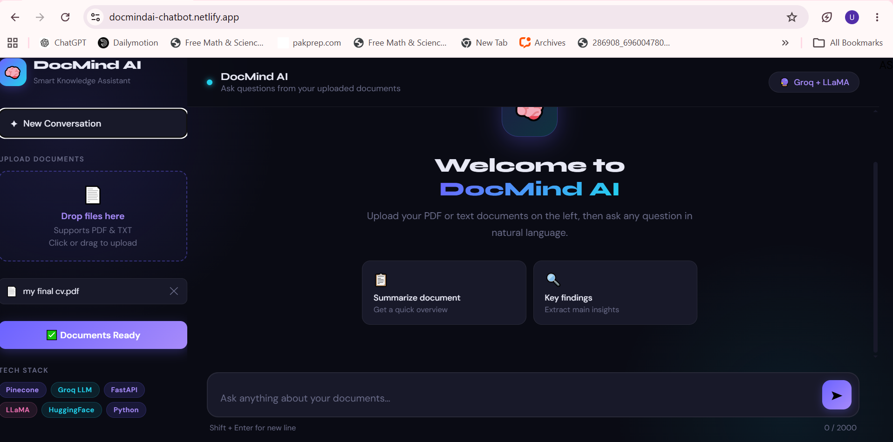
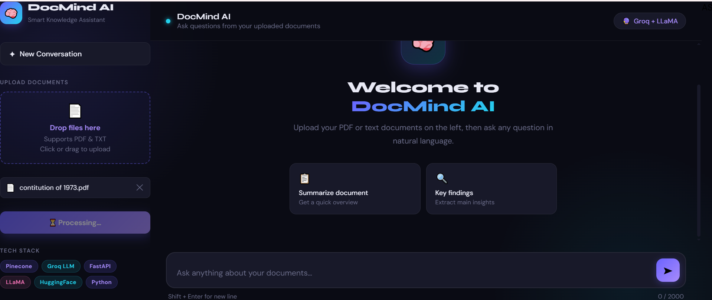
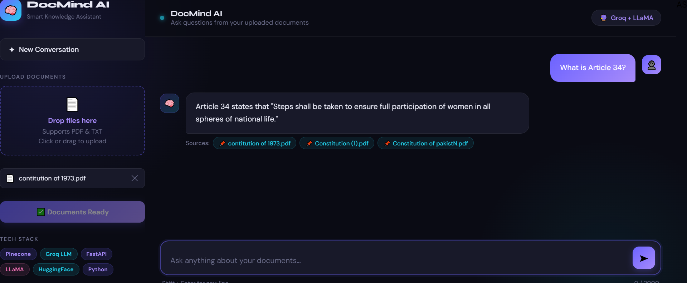

# 🧠 DocMind AI

**A Retrieval-Augmented Generation (RAG) chatbot that answers questions from your own documents — with source-attributed, hallucination-resistant responses.**

🔗 **Live Demo:** [docmindai-chatbot.netlify.app](https://docmindai-chatbot.netlify.app/)
💻 **Backend:** Hosted on Hugging Face Spaces


---

## Overview

DocMind AI lets you upload your own PDF or text documents and ask natural-language questions about their content. Instead of relying on a language model's general knowledge (and risking hallucinated answers), it retrieves the most relevant chunks of *your* documents from a vector database and grounds the LLM's response strictly in that context — every answer comes with the source document it was pulled from.

It also supports **voice queries** — ask your question by speaking, and the app transcribes it and runs it through the same retrieval pipeline.

## ✨ Features

- **Document upload & indexing** — upload PDF or `.txt`/`.md` files; text is extracted, chunked, embedded, and stored in a Pinecone vector index
- **Semantic search (RAG)** — retrieves the top-matching chunks for a query using multilingual embeddings, rather than simple keyword matching
- **Source-attributed answers** — every response lists which uploaded document(s) it was generated from, so answers are verifiable, not just plausible-sounding
- **Hallucination guardrails** — the LLM is explicitly prompted to answer only from retrieved context, and to say so when the answer isn't in the documents, rather than making something up
- **Voice input** — ask questions by voice; audio is transcribed via Groq's hosted Whisper model before being run through the RAG pipeline
- **Fast inference** — uses Groq's LLM inference (LLaMA 3.3 70B) for low-latency responses
- **Chat interface** — clean web UI with conversation history, drag-and-drop file upload, and real-time backend status

## 🧠 How It Works

1. **Ingestion:** Uploaded documents are parsed (`pdfplumber` for PDFs), split into overlapping word-based chunks (500 words, 50-word overlap) to preserve context across chunk boundaries
2. **Embedding:** Each chunk is embedded using Pinecone's hosted `multilingual-e5-large` model and stored in a Pinecone index alongside its source metadata
3. **Retrieval:** On a query, the question is embedded the same way, and the top-3 most similar chunks (above a relevance threshold) are retrieved
4. **Generation:** Retrieved chunks are injected into a strict context-only prompt sent to Groq's LLaMA 3.3 70B model, which generates the final answer
5. **Attribution:** The source document(s) behind the retrieved chunks are returned alongside the answer

## 🛠️ Tech Stack

| Layer | Technology |
|---|---|
| Backend API | FastAPI |
| LLM Inference | Groq (LLaMA 3.3 70B) |
| Speech-to-Text | Groq (Whisper Large v3) |
| Vector Database | Pinecone |
| Embeddings | Pinecone Inference (`multilingual-e5-large`) |
| PDF Parsing | pdfplumber, pypdfium2 |
| Frontend | HTML/CSS/JavaScript |
| Backend Hosting | Hugging Face Spaces |
| Frontend Hosting | Netlify |

## 📁 Project Structure

```
DocMind-Ai/
├── backend/
│   ├── main.py               # FastAPI app — /ask, /ask-voice, /upload endpoints
│   ├── rag_engine.py          # Core RAG logic — embeddings, retrieval, generation
│   ├── pdf_processor.py       # Document parsing & chunking
│   ├── upload_documents.py    # Document ingestion utility
│   ├── requirements.txt
│   └── Docker                 # Containerization for deployment
├── frontend/
│   ├── app.py
│   └── index.html             # Chat UI
├── requirements.txt
└── README.md
```

## 🚀 Getting Started

### Prerequisites
- Python 3.9+
- API keys for [Groq](https://console.groq.com/) and [Pinecone](https://www.pinecone.io/)

### Backend Setup

```bash
cd backend
pip install -r requirements.txt
```

Create a `.env` file in the `backend/` directory:
```
GROQ_API_KEY=your_groq_api_key
PINECONE_API_KEY=your_pinecone_api_key
PINECONE_INDEX_NAME=your_index_name
```

Run the API:
```bash
python main.py
```

### Frontend Setup

The frontend is a static HTML/JS app. Open `frontend/index.html` in a browser, or serve it locally:
```bash
cd frontend
python -m http.server 3000
```

> ⚙️ Update the `API_URL` constant in `index.html` to point to your running backend before use.

## 🖼️ Screenshots

<table>
  <tr>
    <td align="center"><b>Welcome Screen</b></td>
    <td align="center"><b>Document Processing</b></td>
  </tr>
  <tr>
    <td></td>
    <td></td>
  </tr>
</table>

**Source-attributed answer** — query answered directly from an uploaded copy of the Constitution of Pakistan, with the exact source document cited:



## 📡 API Endpoints

| Endpoint | Method | Description |
|---|---|---|
| `/` | GET | Health check |
| `/upload` | POST | Upload and index a document |
| `/ask` | POST | Ask a text question, get a source-attributed answer |
| `/ask-voice` | POST | Ask a question via audio file (transcribed then answered) |

## 🗺️ Roadmap

- [ ] Multi-document conversation memory across sessions
- [ ] Support for `.docx` and `.csv` uploads
- [ ] Streaming responses for faster perceived latency
- [ ] User authentication for persistent document libraries

## 📄 License

This project is open source and available under the [MIT License](LICENSE).

---

<p align="center">Built with ❤️ by <a href="https://github.com/uroojbuilds">Urooj</a></p>
